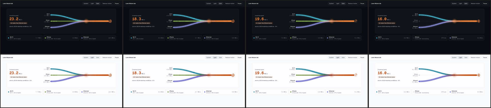
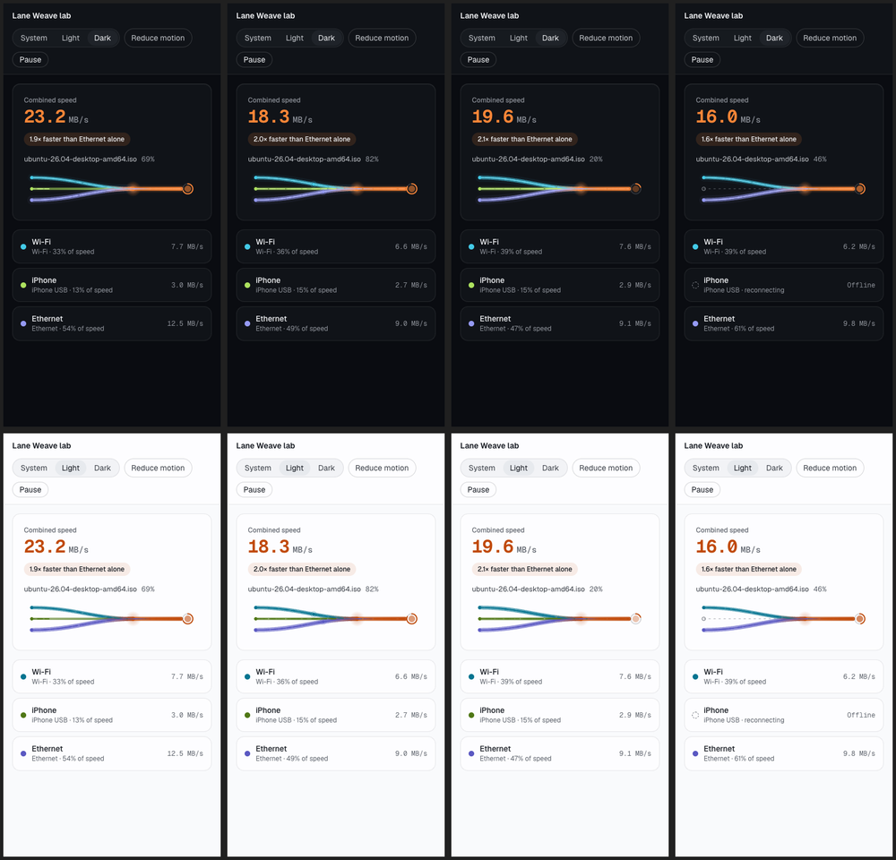
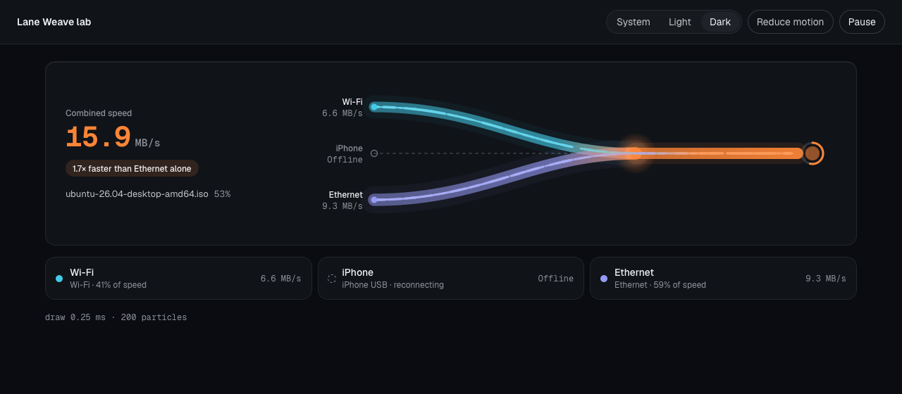

# Spike S9: Lane Weave, the "hardest second first"

- Date: 2026-10-08 · Code: branch `spike/s9-lane-weave` (`spikes/s9-lane-weave`, never merged) · Run: `pnpm install --ignore-workspace && pnpm dev` → http://localhost:5179 (`?t=7&theme=light&reduced=1&debug=1`)
- Status: **superseded by [S9b Fuse Core](S9b-fuse-core.md)** (2026-10-08). The owner found this composition too close to Plexo's combine diagram. Kept as history; its rendering and measurement lessons still apply.

## What was built

A standalone lab page with the real design tokens (`packages/ui/src/tokens.css`) and Geist fonts:
- **Canvas 2D Weave:**
  - one ribbon per network, with thickness following √(rate);
  - particles = blocks in flight at speeds relative to each lane's share;
  - lanes braid into the warm Fuse current at a glowing fuse point;
  - the current flows into the file node, whose ring shows progress and pulses as blocks arrive.
- **States:**
  - a dropped lane frays (particles scatter and fade), then shows a dashed grey path and a hollow node;
  - a returning lane re-weaves from its source;
  - a hedge race shows two sparks, and the loser fizzles before the fuse point.
- **Synthetic, deterministic feed** (seeded noise plus a 16 s timeline). `?t=` replays from 0 at a fixed 60 Hz step, so any instant renders identically: the test clock that contact sheets need (MOTION.md §6).
- **Responsive:**
  - wide: labels beside the lanes;
  - regular: stacked;
  - compact (< 640px): a 72px band, with a legend carrying the labels.
- **Accessibility:**
  - reduced motion means static ribbons and no particles;
  - theme System, Light and Dark;
  - the readout updates at most 4×/s with tabular numbers;
  - drawing stops while the page is hidden.

## Measurements (budget: ≤ 2 ms/frame on Apple Silicon, ≤ 4 ms on WebKitGTK)

| Engine | Draw time per frame | Particles |
|---|---|---|
| Chromium (Playwright), Apple Silicon, DPR 1 | **0.28–0.39 ms** | 215–260 |
| WebKit 26.6 (Playwright), Apple Silicon, DPR 1 | **0.25–0.31 ms** | ~200 |
| Reduced motion | 0.09 ms | 0 |

There is lots of headroom. Still to measure: DPR 2 on a Retina window inside the real Tauri WKWebView (S7), and WebKitGTK on Linux with NVIDIA/Wayland (S7).

## Contact sheets

Columns are, in order, t = 10.4 s (re-weave), 12.4 s (hedge race), 3 s (steady), 7 s (iPhone offline). Top row dark, bottom row light.

WebKit render, dark, tether offline:

## Findings

1. **Canvas 2D is plenty.** No need for PixiJS or WebGL; a few hundred particles cost well under 1 ms.
2. **Additive blending washes particles to white.** Use normal blending for particles and keep `lighter` only for the soft ribbon glow (the first render looked muddy until this was fixed).
3. **The fused current must stay slim** (capped at about 16px wide) and stop at the file node's edge, or it swallows the progress ring.
4. **The fuse point needs its own small radial glow** so the "lanes become one" moment reads at a glance.
5. **Resolving OKLCH tokens through a 1×1 canvas** gives exact RGB in both Chromium and WebKit, so colours can be mixed per particle (lane colour warming into Fuse).
6. **pnpm 11 blocks esbuild's install script until it's approved** (`allowBuilds: { esbuild: true }` in `pnpm-workspace.yaml`). The main workspace needs the same entry when Vite arrives in P3.
7. **Copy issue to fix in the app:** when a network's name equals its kind ("Wi-Fi · Wi-Fi"), show the kind only once.

## Decision

Keep this approach for P3 (`Weave` component in `packages/ui`): Canvas 2D, a ring buffer of engine snapshots, and motion values outside React. Port the renderer as a class with the same API (`setSample`, `step`, `render`, `simulateTo`, `layout`).
