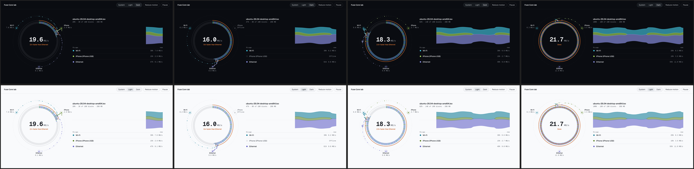
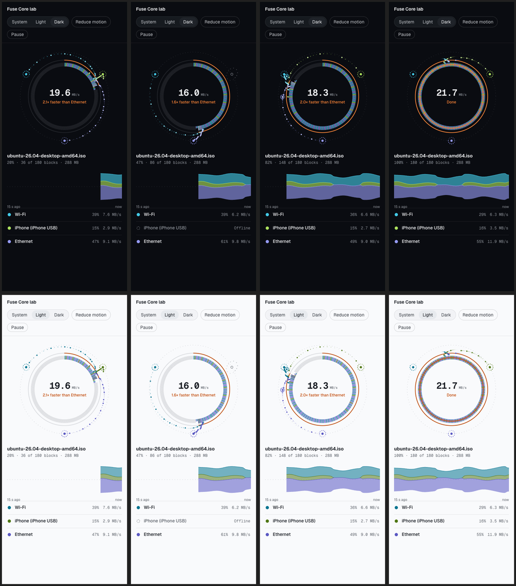
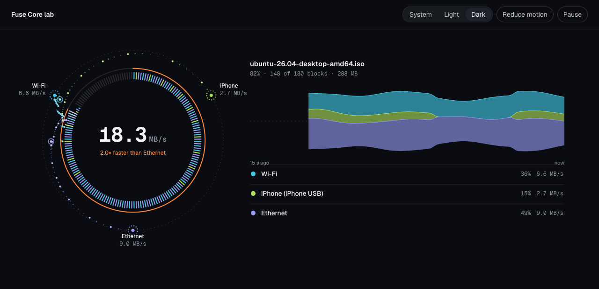

# Spike S9b: Fuse Core (replaces the Lane Weave)

- Date: 2026-10-08 · Code: branch `spike/s9b-fuse-core` (`spikes/s9b-fuse-core`, never merged) · Run: `pnpm install --ignore-workspace && pnpm dev` → http://localhost:5181 (`?t=12.4&theme=light&reduced=1&debug=1`)
- Status: **built and measured; waiting for the owner's approval** of the contact sheets.

## Why S9 was replaced

The owner reviewed S9 (2026-10-08): the "curves merging into one line" Weave reads as **a copy of Plexo's combine diagram**, and a worse one, because the thick tube backgrounds look heavy where Plexo's plain dashed lines look cleaner. The owner asked for an original design, researched and better than Plexo's. S9 is kept as history only.

**New rule (DESIGN-SYSTEM §7):** a signature visual must not share its composition with Plexo's UI (left-to-right merge diagram, square block grid, bottom-stacked throughput area).

## Research and influences

Orbit and satellite UI patterns ([shadcn orbits](https://www.shadcn.io/background/orbits), [zumerlab/orbit](https://github.com/zumerlab/orbit) rings and satellites, [radial orbital timeline](https://21st.dev/@jatin-yadav05/components/radial-orbital-timeline)), the "thinking orbs" dotted states from the owner's motion-tips list, streamgraphs for flows over time, and the [Remotion showcase](https://remotion.dev/showcase) habit of motion driven by a clock.

## The design

- **The file is a ring of 180 block ticks.**
  - It fills in the real scheduler's order (lowest pending block first).
  - Each tick grows radially while in flight, and settles in the colour of the network that fetched it, with a brief white flash.
  - The ring becomes a record of who fetched what. It replaces Plexo-style square grids.
- **Each network is a satellite** on a fine dotted orbit:
  - a core dot plus a 12-dot orb spinning at a speed proportional to its throughput;
  - offline: the orb breaks apart and greys out, and the core becomes hollow.
- **Comets** fly from each satellite into the exact tick it's downloading:
  - they move in polar coordinates, sweeping along the orbit then diving in, so they **never cross the centre**;
  - emission rate and speed follow the real rate.
- **Hedge race:** two ringed sparks head for the same tick, and the loser fizzles.
- **Centre:** the combined speed (tabular mono) and "N× faster than X". Fuse orange is reserved for the progress arc, the multiplier and the ignition.
- **Ignition** (completion): a Fuse sweep around the ring, "Done", calm, then the next file.
- **Throughput streamgraph:**
  - a centred silhouette, with thickness = combined speed and layers = networks;
  - crisp 1px top edges;
  - its time window grows from 15 s to 60 s.
- **No card chrome around the hero**, thin strokes only, no tubes.
- **Compact:** the ring is centred at 300px, satellite labels are hidden, and the list carries the names. No horizontal overflow at 390px (checked).

## Measurements

| Check | Result |
|---|---|
| Draw time (Chromium, Apple Silicon) | **0.38 ms/frame** with about 28 comets (budget 2 ms) |
| Overflow at 390px | None |
| Reduced motion | No comets; ticks and arc still show progress |

## Contact sheets

Columns: t = 3 s (steady), 7 s (iPhone offline), 12.4 s (hedge race), 16.3 s (ignition). Top row dark, bottom row light.

Hedge race, dark, wide:

## Next

- Owner approval. Then P3 ports `FuseCore` and `Stream` into `packages/ui` with the same API (`setSample`, `step`, `render`, `simulateTo`, `geometry`).
- Real data replaces the synthetic feed: the core's block map (deltas) drives the ticks; with more than 180 blocks, each tick aggregates several.
